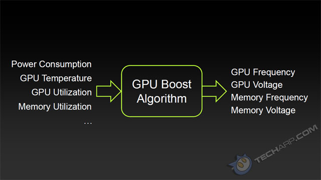

# Power Variability on GPUs

- [Meetings](#meetings)
  - [Outcomes from brainstorming on 2/22](#outcomes-from-brainstorming-on-222)
  - [Questions after initial meeting](#questions-after-initial-meeting)
- [Project Pitch presentation notes](#project-pitch-presentation-notes)
- [TODO](#todo)
- [References](#references)

Predictable performance with power variability on GPUs

## Meetings

Tracking it further [here](https://docs.google.com/document/d/1AMjvg0toY3b7LtDEoe5uqlBuDTOKf4QV9xGNN-G6vjA/edit#heading=h.a0nireiblb9c)

### Outcomes from brainstorming on 2/22

Two possible approaches:

- Take a single machine and try effects of spatial and temporal locality on the same board
  - Prove manual placement of workload is better than random
  - Objective: Be able to ascertain ideal placement factoring in power variability on real case machines 
  - Reference to Ashwin's work on the Jetson boards
  - Can use dP/dt to assume variability as long as it is within the envelope
  - We might not have access
- Explaining GPU boost
  - Check if previous work had this enabled by default

Identify parameters to quantify power variability via profiling + those that can be treated as constants during analysis

Identify data parallel workloads and patterns in ML workloads that tend to exhibit such variations

Power-aware scheduling to navigate the power-performance tradeoff problem in GPUs: 
Higher power draw than CPU, susceptible to intra/inter-device variations
Use of multi-GPU clusters with high BW interconnects ↑, susceptibility to inter-device variations ↑, due to spatial locality

### Questions after initial meeting

Questions for meeting on 2/22

- Power draw over PCIe
- cuBLAS SGEMM reflecting realism?
- Runtime duration primary component in measurements
- Summit Analysis for spatial locality effects
- Distinguish DRAM/MC power useful for irregular workloads and attribution? TGP vs TDP
- Similar to di/dt should we try dP/dt to first experimentally determine effects such as throttling etc? Testbench of sorts using something like PowerNetics https://www.tomshardware.com/reviews/power-consumption-measurement-cpu-gpu-components-powenetics,5481.html
- Is there value in studying GPU Boost since it is within the power envelope? 
- Can we attempt data parallel algorithms like BytePS or Horovod to measure this new dimension to have a holistic analysis?

## Project Pitch presentation notes

[Slides](docs/839%20Adv%20ML%20Sys_%20Power%20Variability.pptx)

Like Ashwin mentioned, variability gets worse with scale which is concerning for massively parallel workloads

We plan to approach this in 3 steps

The first one is profiling at the device level to identify measurable factors that can impact variability

This is important because a lot of detail on dvfs, and variability is usually hidden in fine print. 

Like we see here for the a100 GPU power is shown as a constant but it almost never is and it makes performance unpredictable.  So as an example that there's more to system perfomance than just TDP, this shows the control state logic for an Intel CPU here and similarly factors that affect boost on a GPU

Once we've identified the factors, we want to characterize workloads that exhibit these variations. Benchmarks today don't account for them. To fundamentally understand variations by correlation we want to cover something we call  the ABC's of characterization to include applications, bottlenecks and system configuration. 

From previous work, we think that there are two ways to deal with variability. One is a variability aware scheduling that minizes the effect of variations by considering factors we discussed earlier. The other one is interesting because the variations we've been talking about can also affect neighboring GPUs. Here we see a single node of DGX that is clearly packed to the brim and this is where variability guidance for spatial effects maybe useful.

## TODO

- Take style from MegaTron to state in-summary of Shivaram discussion and motivation

## References

https://slideplayer.com/slide/8097523/
https://citeseerx.ist.psu.edu/viewdoc/download?doi=10.1.1.101.3059&rep=rep1&type=pdf
https://www.hindawi.com/journals/sp/2017/8686971/
https://www.synergylabs.org/bharath/files/Balaji_HotPower12_Variability-Characterization.pdf
http://charm.cs.illinois.edu/newPapers/18-06/thesis.pdf
https://www.usenix.org/system/files/conference/hotpower12/hotpower12-final29.pdf
https://www.sc17.supercomputing.org/SC17%20Archive/doctoral_showcase/doc_files/drs117s2-file2.pdf

Variability at scale in GPU system