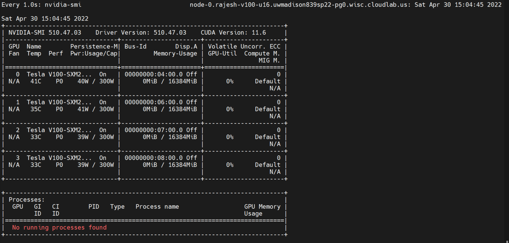
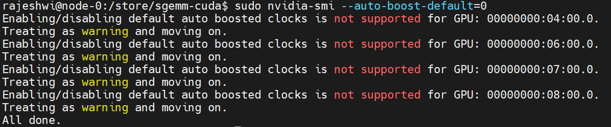
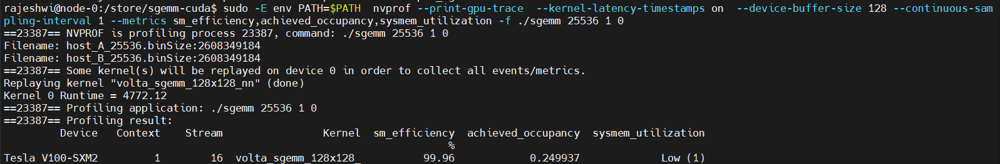
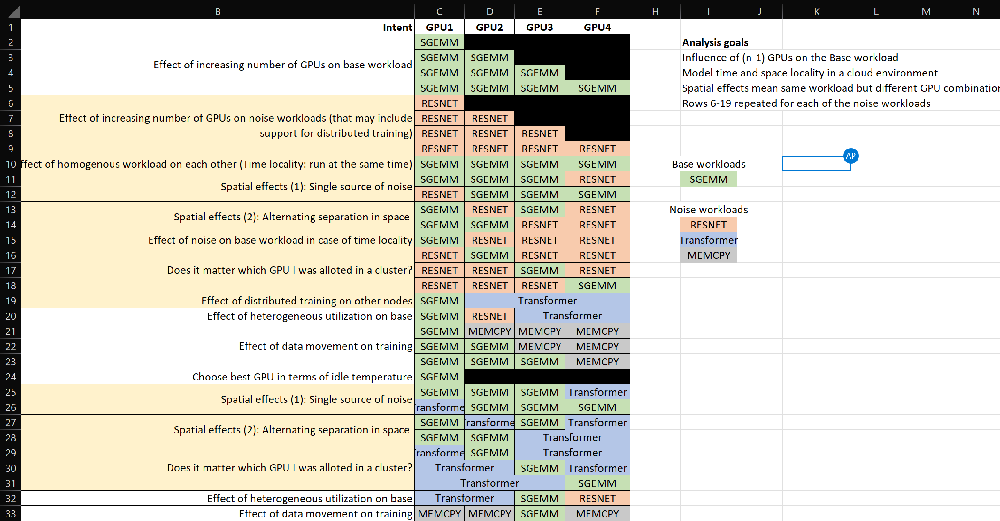
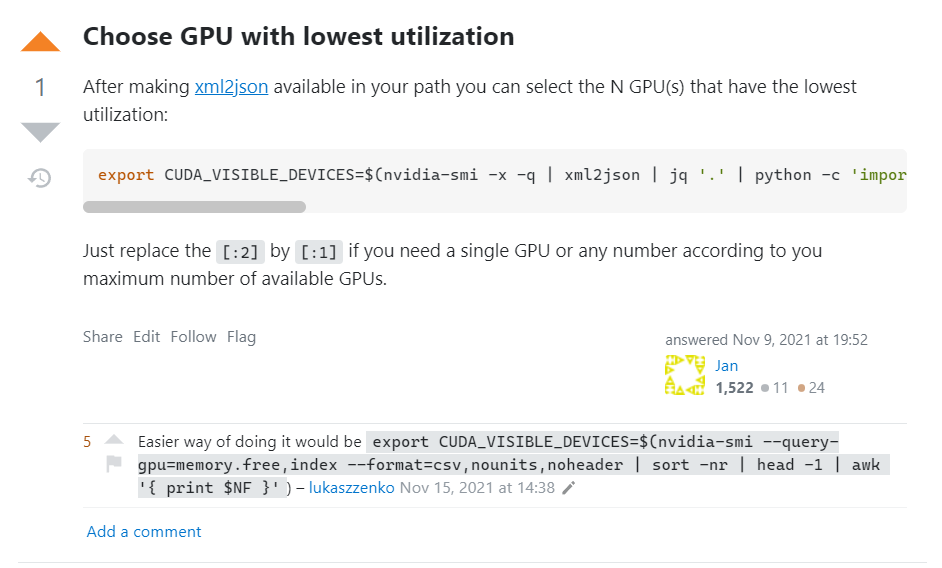
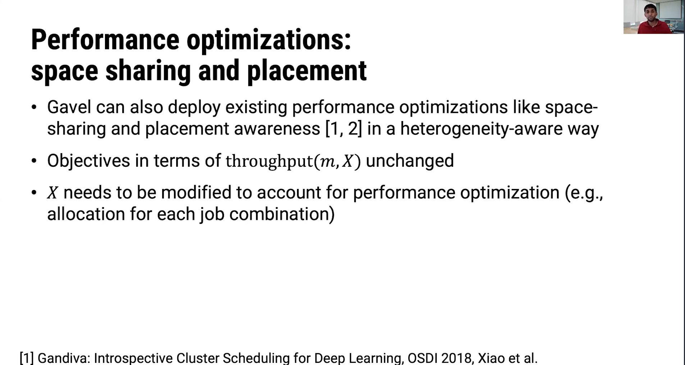
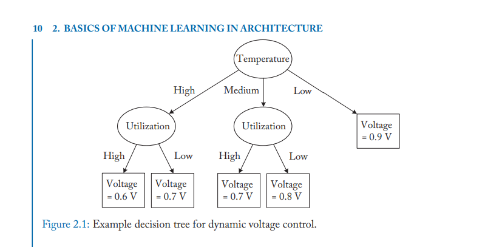
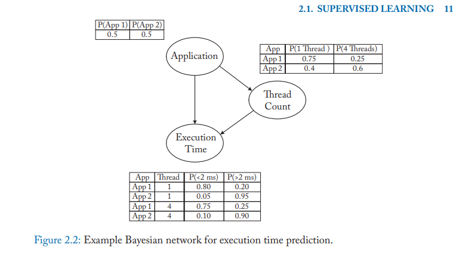
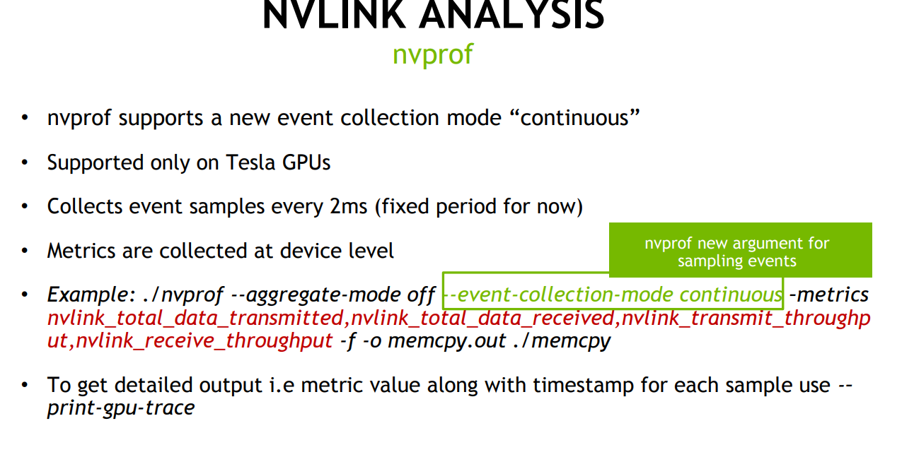
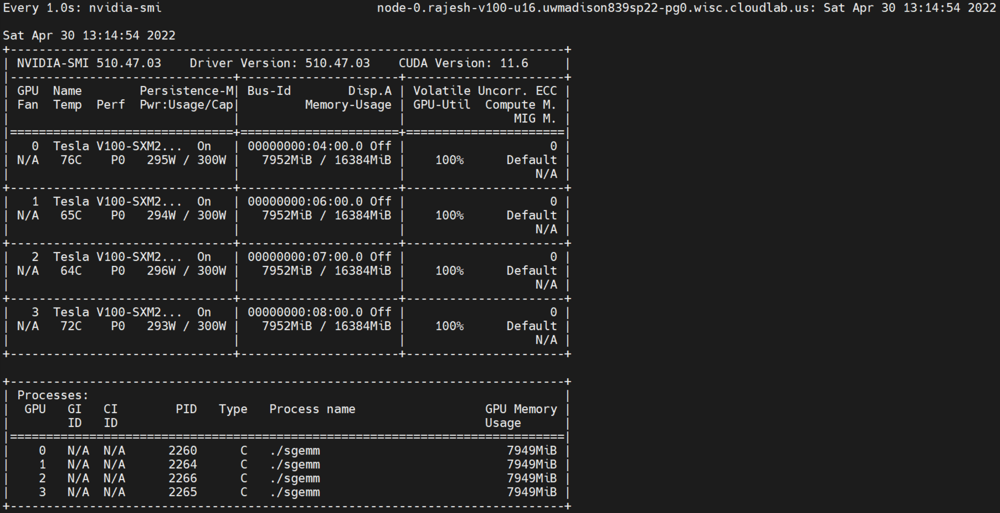

# Power Variability on GPUs

- [Goals](#goals)
- [1. Environment](#1-environment)
- [2. Experimental assumptions](#2-experimental-assumptions)
- [3. Characterization](#3-characterization)
  - [3.1. Base workload: SGEMM](#31-base-workload-sgemm)
  - [3.2. Noise workloads](#32-noise-workloads)
    - [3.2.1. RESNET50](#321-resnet50)
    - [3.2.2. Transformers](#322-transformers)
  - [3.3. Run scripts](#33-run-scripts)
- [4. Handy Nvidia GPU commands](#4-handy-nvidia-gpu-commands)
- [5. Notes](#5-notes)

## Goals

- Achieve fairness and predictable performance in large cluster deployments for ML training, but not microsecond level predictability. Variations are natural in interactive systems.
- If GPU0 is most frequently used and is susceptible to wear, can I save money on large scale training by just asking for the 4th GPU always? Wear levelling for GPUs. Idle power example: 
- Everyone wants 100% utilization and 300W of power, Rowhammer for GPUs, make surrounding GPUs slower?
- Second order effects: Temperature, cooling, placement in cluster

## 1. Environment

- Setup CUDA quickly on cloud machines. [Command reference](helper/install_cuda.sh)
- We designed the experiment space accounting for two things: statistical variation (taking mean between runs) and power variation (actual variation in system parameters we are trying to observe)

## 2. Experimental assumptions

- Run nvprof on all to ensure the same overheads across GPUs. Also, nvprof continuous collection does not capture kernel details running on other GPUs but still captures temperature, frequency, voltage on other GPUs
- V100 does not support disabling autoboost. We observed overshoot about 300W upto 325W in many cases. 

## 3. Characterization

### 3.1. Base workload: SGEMM

CUDA version of a sgemm kernel is included in this repository

Compile sgemm and gen_data using:
```make```

Before you run the kernel you need to generate the data using the following:
````gen_data <square matrix dimension>````

The compiled binary can be run from the command line as follows:
`sgemm <square matrix dimension> <number of repetitions> <target GPU Id>`

Profiling:

- On V100, where _nvprof_ is supported to get system metrics ```nvprof --print-gpu-trace --event-collection-mode continuous --system-profiling on --kernel-latency-timestamps on --csv --log-file sgemm_test.csv --device-buffer-size 128 --continuous-sampling-interval 1 -f ./sgemm 2 1 0```
- To get metrics such as utilization for the sgemm kernel, do not use _event-collection-mode_ ```sudo -E env PATH=$PATH  nvprof --print-gpu-trace  --kernel-latency-timestamps on  --device-buffer-size 128 --continuous-sampling-interval 1 --metrics sm_efficiency,achieved_occupancy,sysmem_utilization -f ./sgemm 2 1 0```
- On Ampere/Turing where _nvprof_ is not directly supported ```nsys nvprof sudo -E env PATH=$PATH nvprof --profile-from-start off --log-file test sgemm 2 1 0```

Insights:

- Choosing 25536 results in maximum compute utilization on the V100. Use profiling to ensure that this is tuned for specific GPUs 

### 3.2. Noise workloads

**Reasoning behind choice**: Vision Models (Compute intensive) and Language Models (Memory Intensive, DistributedDataParallel)



#### 3.2.1. RESNET50

Implementation used: [Nvidia DL Examples Resnet50v1.5](https://github.com/NVIDIA/DeepLearningExamples/tree/master/PyTorch/Classification/ConvNets/resnet50v1.5#training-performance-benchmark)

- TinyML dataset ```wget https://image-net.org/data/tiny-imagenet-200.zip```
- Imagenet dataset ```wget https://image-net.org/data/ILSVRC/2012/ILSVRC2012_img_train.tar```. Extract, pre-process with commands on repo. Use tmux and docker without `rm` to process the data and then copy it to outside the container. The processed data can be used while launching the container for training
- Launch docker with: ```nvidia-docker run -it -v /store/DeepLearningExamples/PyTorch/Classification/imagenet:/imagenet --ipc=host nvidia_resnet50```
- Run training ```python ./main.py --arch resnet50 --data-backend pytorch --label-smoothing 0.1 /imagenet```
- Run training with nvprof ```nvprof --print-gpu-trace --event-collection-mode continuous --system-profiling on --kernel-latency-timestamps on --csv --log-file resnet.csv --device-buffer-size 128 --continuous-sampling-interval 1 -f python ./main.py --arch resnet50 --data-backend pytorch --batch-size 128 --epochs 1 --label-smoothing 0.1 /imagenet```
- [Modified version](https://github.com/rajesh-s/DeepLearningExamples/commit/eee1b358834178c4f8bb05a1f7a40671a7a9b2cd) to allow selecting GPU core to run on in RESNET ```nvprof --print-gpu-trace --event-collection-mode continuous --system-profiling on --kernel-latency-timestamps on --csv --log-file resnet.csv --device-buffer-size 128 --continuous-sampling-interval 1 -f python ./main.py --arch resnet50 --data-backend pytorch --batch-size 128 --epochs 2 --gpu_core 2 --label-smoothing 0.1 /imagenet```

#### 3.2.2. Transformers

- Launch docker with ```nvidia-docker run -it --ipc=host -v /store/DeepLearningExamples/PyTorch/Translation/Transformer/data/data/wmt14_en_de_joined_dict:/data/wmt14_en_de_joined_dict your.repository:transformer bash```
- Run preprocessing `scripts/run_preprocessing.sh`
- Run training `scripts/run_training.sh`

### 3.3. Run scripts

## 4. Handy Nvidia GPU commands

- Kill processes on GPUs ```sudo fuser -k /dev/nvidia0/1/2/3```
- nvidia-smi in continuous monitoring mode ```$ watch -n 1 nvidia-smi```
- Querying stats from nvidia smi ```nvidia-smi --format=csv --query-gpu=power.min_limit```

## 5. Notes

https://stackoverflow.com/questions/39649102/how-do-i-select-which-gpu-to-run-a-job-on



Power-aware cluster scheduling for ML inference



present the massive parameter design space for training production-scale deep learning recommendation models.

Exploiting scale in both training data and model size has been central to the success of deep learning







Statistical:

__PREFETCH=off
Persistence

https://nvidia.custhelp.com/app/answers/detail/a_id/3751/~/useful-nvidia-smi-queries
Any settings below for clocks and power get reset between program runs unless you enable persistence mode (PM) for the driver.



Step power using nvidia limits

Power-aware scheduling to navigate the power-performance tradeoff problem in GPUs: 
Higher power draw than CPU, susceptible to intra/inter-device variations
Use of multi-GPU clusters with high BW interconnects ↑, susceptibility to inter-device variations ↑, due to spatial locality

- Take style from MegaTron to state in-summary of Shivaram discussion and motivation

Variability at scale in GPU system

https://slideplayer.com/slide/8097523/
https://citeseerx.ist.psu.edu/viewdoc/download?doi=10.1.1.101.3059&rep=rep1&type=pdf
https://www.hindawi.com/journals/sp/2017/8686971/
https://www.synergylabs.org/bharath/files/Balaji_HotPower12_Variability-Characterization.pdf
http://charm.cs.illinois.edu/newPapers/18-06/thesis.pdf
https://www.usenix.org/system/files/conference/hotpower12/hotpower12-final29.pdf
https://www.sc17.supercomputing.org/SC17%20Archive/doctoral_showcase/doc_files/drs117s2-file2.pdf