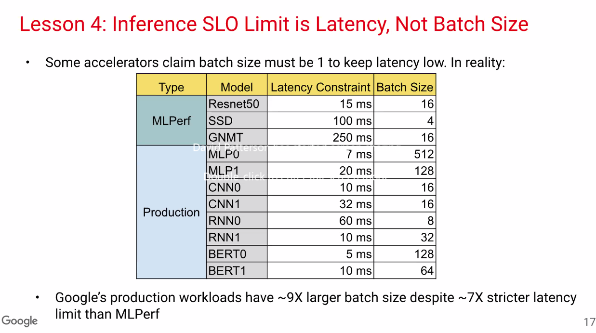
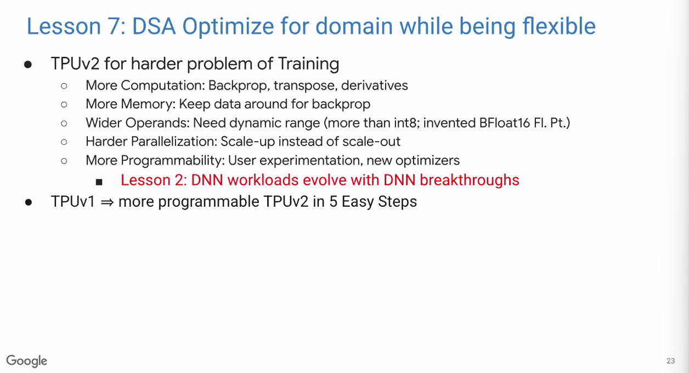
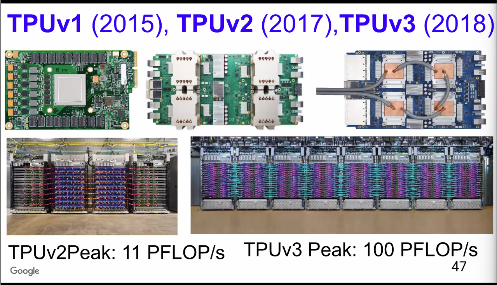
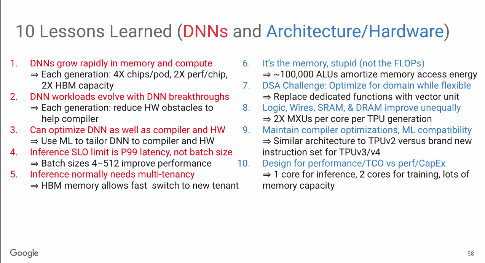
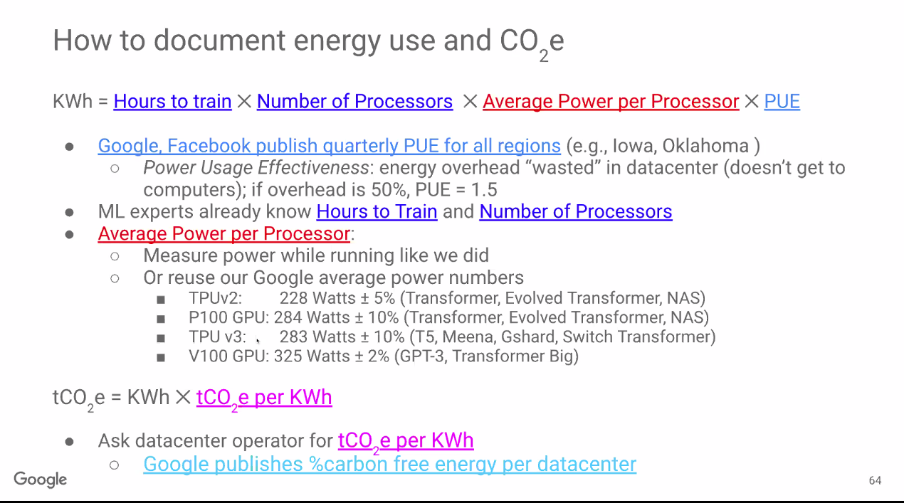
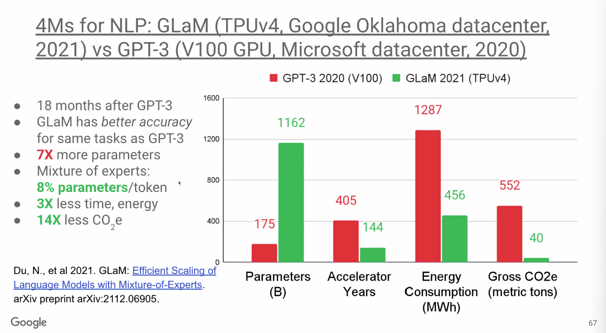

10 Lessons in ML Systems by Prof. David Patterson from the Google TPU project as a case study

--- DNN lessons ---
1. DNN Model Growth: Models growing at an exponent rate
2. DNN workloads "evolve" with breakthroughs Eg: RNN replace LSTM, BERT saw unprecedented adoption in 2years
3. Can optimize DNN as well as compiler and hardware as long as quality is maintained/improved
4. Inference SLO limit is latency not batch size 
5. Production inference needs **multi-tenancy**. inferencing applications need to support multiple models (including experimental ones) and batch sizes

--- Hardware and Compiler lessons ---
6. **Energy** limits modern chips not transistors. One manifestation is the off-chip memory accesses. DNN developers benefit more from reducing memory accesses, ok to have more FLOP requirements. Systolic arrays are more efficient than pipelines. Simpler regular interconnects lead to cheaper implementation and high densities for compute
7. Domain Specific Optimization needs to avoid overfitting 
8. Hardware needs to scale. Notice the bigger and bigger heat sinks on every generation of TPU . TPUs included lot more counters to enable performance optimizations through compiler and models
9. Maintain compiler optimizations and ML compatibility. XLA does whole DFG optimization. Operator fusion a key technique in reducing memory needs. Compilers take time to mature and produce good quality curve. "The learning curve for domain-specific hardware". Same optimizations are desired across backends and between training/inference
10. Chip vendors focus on Performance/Capital Expenditure. Custom stacks like the TPU focus on Performance/Total Cost of Ownership including power.

Summary: 

Carbon-aware sustainable computing

MoE savings in energy:

Did some back of the envelope calculations for our CS839 project experiments.

1.2kW (4xV100) running at full utilization for about 24 hours of experiments is roughly the same energy consumption and carbon footprint as a Tesla driven for 100+ miles

